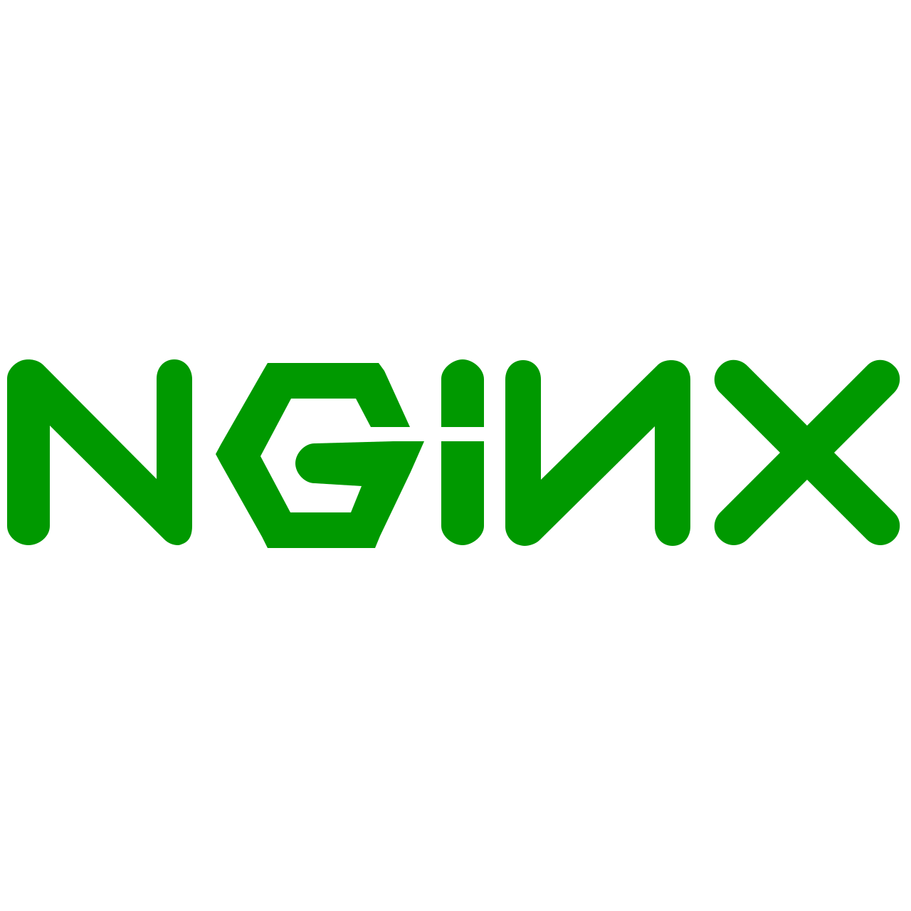

### Hello There! 

 <strong>Open Source is ❤</strong> 

---

- :computer: I love to code
- :muscle: I'm a full stack developer (MERN)
- :palm_tree: An open source enthusiast
- :iphone: Currently learning mobile app development with flutter
- :seedling: Constantly learning new skills

 
 

 

 
 

### Languages and Tools :

 
 

### Find me on :

